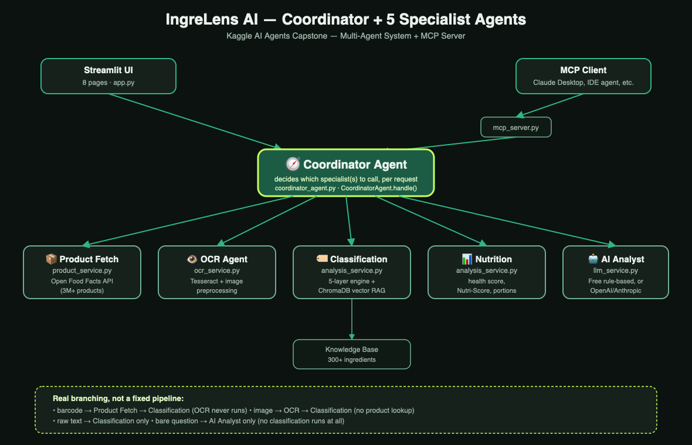

# 🌿 IngreLens AI

> **AI-powered ingredient intelligence platform** — Vegan classification, allergy detection, health insights & conversational AI assistant.

**Tagline:** *SCAN, ANALYSE & EAT SMARTER*

[](https://ingrelens-ai.streamlit.app/)
[](https://python.org)
[](https://streamlit.io)
[]()
[]()
[]()
[]()
[](LICENSE)

**🔴 Live demo: [ingrelens-ai.streamlit.app](https://ingrelens-ai.streamlit.app/)** — no login, no setup, click and use it now.

---

## 🧩 The Problem

A shopper standing in an aisle with a food label has three bad options: trust
the marketing on the front of the pack (which is legally allowed to say
"natural" next to an ingredient list a dozen items long), search each
ingredient one at a time on their phone, or guess. None of that scales to
the reality that "vegan," "vegetarian," and "allergen-free" are not one
yes/no fact — they depend on ingredient-level provenance (is the rennet in
this cheese microbial or animal? is this natural flavor derived from
carmine?) that no single lookup answers.

**Why a single LLM call doesn't solve this:** ask one model "is this vegan"
and it pattern-matches on ingredient *names*, with no structured knowledge
base, no allergen taxonomy, no confidence signal, and no way to tell you
*which* ingredient it's unsure about. It also can't fetch a barcode, can't
run OCR on a photo, and can't distinguish "I don't know" from "no." Bolting
all of that into one prompt doesn't produce an agent — it produces a
worse, slower, unauditable version of the deterministic pipeline underneath.

**Why multi-agent + ADK is the right shape for this problem:** the task
genuinely decomposes into independent specialists — resolving a barcode,
reading a label image, classifying ingredients, computing nutrition, and
reasoning in natural language are different skills with different failure
modes, and the actual routing decision (which of these does *this* request
need?) is itself worth making explicit and auditable rather than hidden
inside a prompt. Google's Agent Development Kit gives that decision a real,
inspectable home — one root agent whose `tools` and `sub_agents` list *is*
the set of options, instead of an opaque if/else a judge has to trust.

**Why MCP on top of that matters for scale:** once the specialists exist as
a Coordinator, exposing them over MCP means any MCP-compatible client
(Claude Desktop, an IDE agent, a future internal tool) gets the same
capability for free, without re-implementing the routing logic — and, as
built here, an ADK agent can source its tools *directly from the MCP
server* (see the ADK section below), so the same tool implementation serves
three different front doors (Streamlit UI, MCP client, ADK agent) at once.

---

## 🎯 What It Does

IngreLens AI instantly tells you if any food product is **Vegan, Vegetarian, or contains animal ingredients** — with full explanations, allergen detection, and health scoring.

| Feature | Description |
|---|---|
| 🌱 Vegan classification | Vegan / Vegetarian / Eggetarian / Non-Vegetarian / Uncertain, with confidence % |
| ❌ Non-vegan detection | Exact ingredients flagged with reasons |
| ⚠️ Allergy detection | 10 allergen groups: dairy, eggs, gluten, soy, nuts, shellfish… |
| 🏥 Health scoring | 0–100 score + Nutri-Score A→E |
| 🤖 AI assistant | Chat about any ingredient |
| 📷 OCR scanning | Upload product label images |
| 🔍 Product search | 3M+ products via Open Food Facts |
| ⚖️ Comparison | Side-by-side product analysis |
| 👤 Personalization | Diet mode, allergen alerts, health goals |
| 📚 History | All past scans with charts |

---

## 🏗️ Architecture — Coordinator + 5 Specialist Agents



A single **Coordinator Agent** (`backend/services/coordinator_agent.py`) is
the multi-agent decision point for the whole system: given a barcode, an
image, raw ingredient text, a free-form question, or some combination, it
decides which specialist(s) to invoke and in what order, then returns one
unified result. It is not a fixed pipeline — a barcode request never touches
OCR, a bare question never runs classification. See `CoordinatorAgent.handle()`
for the actual branching logic, and `tests/test_coordinator_agent.py` for
tests that assert on *which* agents ran for a given input, not just the answer.

Two independent callers route through the same Coordinator instead of each
having their own copy of the decision logic: the in-app floating assistant
(`shared_ui.ask_assistant`) and the **MCP server** (`mcp_server.py`), which
exposes it as MCP tools for any MCP-compatible client (Claude Desktop, an
IDE agent, etc.) to call directly — see [MCP Server](#-mcp-server) below.

```
                              User
                               │
                       ┌───────▼────────┐
                       │  Streamlit UI   │  8 pages
                       └───────┬────────┘         MCP Client
                               │                   (Claude Desktop, etc.)
                       ┌───────▼────────┐              │
                       │  🧭 Coordinator │◄─────────────┘
                       │      Agent      │   mcp_server.py
                       └──┬───┬───┬───┬──┘
              ┌───────────┘   │   │   └───────────┐
              ▼               ▼   ▼               ▼
     📦 Product Fetch    👁️ OCR   🏷️ Classification   🤖 AI Analyst
          Agent          Agent        Agent              Agent
              │                          │                  │
       Open Food Facts             Knowledge Base      LLMService
       (3M+ products)             (300+ ingredients)  (rule-based free
                                        │              tier, or OpenAI/
                                   ChromaDB RAG         Anthropic if a
                                 (Vector Search)        key is set)

                       📊 Nutrition Agent — health score, Nutri-Score,
                          portion math & daily-consumption tracking
                          (analysis_service.py + shared_ui.py)
```

**Classification pipeline (5 layers, inside the Classification Agent):**
1. Exact KB match → 2. Alias match → 3. Keyword rules → 4. Vector semantic search → 5. Fallback

---

## 🚀 Quick Start

### Local (Python)

```bash
# 1. Clone
git clone https://github.com/anvithatvns/IngreLens-AI.git
cd IngreLens-AI
git checkout kaggle   # this is the branch with the full submission

# 2. Install dependencies
pip install -r requirements.txt

# 3. (Optional) Install Tesseract for OCR
# macOS:  brew install tesseract
# Ubuntu: sudo apt-get install tesseract-ocr
# Windows: https://github.com/UB-Mannheim/tesseract/wiki

# 4. (Optional) Add LLM API key for enhanced AI
cp .env.example .env
# Edit .env — set OPENAI_API_KEY or ANTHROPIC_API_KEY

# 5. Run
streamlit run app.py
# Opens at http://localhost:8501
```

### Docker

```bash
docker-compose up --build
# Opens at http://localhost:8501
```

### Streamlit Cloud (Free — 1 click)

**Already deployed and live: [ingrelens-ai.streamlit.app](https://ingrelens-ai.streamlit.app/)** — deployed from the `kaggle` branch, `app.py` as the entry point, no API keys required.

To deploy your own copy:
1. Push to GitHub
2. Go to [share.streamlit.io](https://share.streamlit.io)
3. New app → select repo → branch `kaggle` → `app.py`
4. Deploy ✅ *(No API keys needed — works free)*

---

## 🔌 MCP Server

`mcp_server.py` exposes the same Coordinator Agent the Streamlit app uses as
[Model Context Protocol](https://modelcontextprotocol.io) tools, so any
MCP-compatible client can call into IngreLens AI directly — no web UI needed.

```bash
pip install -r requirements.txt   # includes the mcp SDK
python mcp_server.py              # stdio transport
```

**Tools exposed:**

| Tool | Routes to (via the Coordinator) |
|---|---|
| `analyze_ingredients(ingredients_text, product_name)` | Classification Agent |
| `analyze_barcode(barcode)` | Product Fetch Agent → Classification Agent |
| `ask_ingredient_question(question)` | AI Analyst Agent |

**Claude Desktop config** (`claude_desktop_config.json`):
```json
{
  "mcpServers": {
    "ingrelens-ai": {
      "command": "python",
      "args": ["/absolute/path/to/mcp_server.py"]
    }
  }
}
```

Verify it directly (no MCP client needed) — this is the same call the tests make:
```bash
python -c "
import asyncio
from mcp_server import mcp
print(asyncio.run(mcp.call_tool('analyze_ingredients', {
    'ingredients_text': 'Sugar, Palm oil, Skimmed milk powder',
    'product_name': 'Test',
})))
"
```

---

## 🧠 Google ADK Agent Layer

`backend/adk/` puts the same Coordinator + 5 specialists onto native
[Google ADK](https://google.github.io/adk-docs/) primitives — an additional,
opt-in interface onto the exact same tool implementations, not a rewrite:

| Specialist | ADK primitive | Why |
|---|---|---|
| Product Fetch | `FunctionTool` | deterministic data fetch — nothing to reason about |
| OCR | `FunctionTool` | deterministic extraction — nothing to reason about |
| Nutrition | `FunctionTool` | deterministic computation — nothing to reason about |
| Classification | `Agent` (LlmAgent) sub-agent | reasons about *why* (names the specific ingredient, explains the category), not just a raw return value |
| AI Analyst | `Agent` (LlmAgent) sub-agent | fallback reasoning agent for free-form questions with no product data |
| **Coordinator** | **`Agent` (LlmAgent), root** | its `tools=[...]` and `sub_agents=[...]` list *is* the routing decision — ADK resolves which one actually gets called, instead of our own if/else |

```
                    ┌──────────────────────────┐
                    │   root_agent (ADK)        │
                    │   "ingrelens_coordinator"  │
                    └─┬──────┬──────┬───────────┘
        tools ─────────┘      │      └───────── sub_agents
        (FunctionTool)        │                  (Agent, reasoning)
   ┌────────┬────────┬────────┘          ┌────────────┬─────────────┐
   ▼        ▼        ▼                   ▼                         ▼
Product   OCR    Nutrition      classification_agent        ai_analyst_agent
Fetch                            (calls classify_ingredients)  (pure reasoning,
                                                                 no tool)
```

**ADK → MCP → Tools, demonstrated directly:** `backend/adk/agents.py` also
defines `mcp_backed_coordinator()`, an alternate Coordinator whose tools come
from **our own `mcp_server.py` over stdio** via ADK's `McpToolset`, instead
of in-process `FunctionTool`s:

```python
from backend.adk.agents import mcp_backed_coordinator
agent = mcp_backed_coordinator()   # tools sourced live from mcp_server.py
```

This is verified with a real subprocess handshake (no LLM call needed to list
tools) in `tests/test_adk_agents.py::TestADKMCPIntegration` — ADK spawns
`mcp_server.py`, lists its tools over the MCP protocol, and gets back exactly
`analyze_ingredients`, `analyze_barcode`, `ask_ingredient_question`.

**Setup:**
```bash
pip install -r requirements-adk.txt   # separate from requirements.txt on purpose
export GOOGLE_API_KEY=your-key-here   # or configure Vertex AI credentials
```

```python
from backend.adk.agents import root_agent
from google.adk.runners import InMemoryRunner

runner = InMemoryRunner(agent=root_agent)
# runner.run(...) processes a live turn — requires GOOGLE_API_KEY above.
```

**Why this is a separate, opt-in layer and not the default path:** the
Streamlit app and the MCP server both work with zero configuration and zero
API keys — that's a deliberate free-tier design choice this project already
makes for `llm_service.py`. `Agent` in ADK is inherently model-backed
(`Agent is LlmAgent`), so requiring it as the *only* path would break that
promise. Every object in `backend/adk/` is verified to construct correctly
without any key (`tests/test_adk_agents.py`, 11 tests, all passing); running
an actual live turn is the one piece that needs `GOOGLE_API_KEY` — see the
Risk Checklist for the honest version of this tradeoff.

---

## 🧪 Running Tests

```bash
# Full test suite (151 tests)
python -m pytest tests/test_complete_suite.py -v

# Original unit tests (26 tests)
python -m pytest tests/test_analysis.py -v

# Coordinator Agent routing tests (6 tests) — asserts on *which* agents ran
python -m pytest tests/test_coordinator_agent.py -v

# ADK agent-layer wiring tests (11 tests) — no GOOGLE_API_KEY needed
python -m pytest tests/test_adk_agents.py -v

# Run all tests
python -m pytest tests/ -v

# Evaluation harness — 20 edge cases, routing/classification/fallback/tool metrics
python -m evaluation.run_evaluation --report evaluation/last_report.md

# Demo dataset (62 products, all categories)
python tests/demo_dataset.py

# With coverage report
pip install pytest-cov
python -m pytest tests/ --cov=backend --cov-report=html
```

**Test results (194 passed, 0 failed):**
```
194 passed in ~33s
✅ Knowledge Base: 19 tests
✅ Ingredient Parser: 15 tests
✅ Classification Engine: 23 tests
✅ Analysis Service: 35 tests
✅ Product Service: 12 tests
✅ OCR Service: 5 tests
✅ AI Agent: 8 tests
✅ Demo Scenarios: 10 tests
✅ OCR Input Scenarios: 7 tests
✅ Security & Validation: 8 tests
✅ Performance: 5 tests
✅ Original unit tests (test_analysis.py): 26 tests
✅ Coordinator Agent routing (test_coordinator_agent.py): 6 tests
✅ ADK agent-layer wiring (test_adk_agents.py): 11 tests
```

**Evaluation harness result (20/20 cases, all 4 metrics 100%)** — see
[`evaluation/README.md`](evaluation/README.md) for the metric definitions and
[`evaluation/last_report.md`](evaluation/last_report.md) for the full
case-by-case detail a judge can check against the raw dataset files.

---

## 📁 Project Structure

```
ingrelens-ai/
│
├── app.py                          ← Home page + Quick Actions + demo mode
├── shared_ui.py                    ← Shared CSS, components, helpers,
│                                      floating AI assistant (routes through
│                                      the Coordinator Agent)
├── mcp_server.py                   ← MCP server — exposes the Coordinator
│                                      Agent as MCP tools
│
├── pages/
│   ├── 1_📷_Scanner.py             ← Image OCR + barcode + manual
│   ├── 2_🔍_Analyzer.py            ← Product search (3M+ products)
│   ├── 3_🔢_Barcode_Lookup.py      ← Manual barcode lookup + paste ingredients
│   ├── 4_⚖️_Comparison.py          ← Side-by-side comparison
│   ├── 5_👤_Preferences.py         ← Diet mode, allergens & health profile
│   ├── 6_📚_History.py             ← Scan history + charts
│   ├── 7_ℹ️_About.py               ← About the app
│   └── 8_🍽️_Food_Logs.py          ← Daily nutrition / food log tracking
│
├── backend/
│   ├── services/
│   │   ├── coordinator_agent.py    ← 🧭 Coordinator Agent — routes a
│   │   │                             request to whichever specialist(s)
│   │   │                             it actually needs
│   │   ├── analysis_service.py     ← 🏷️ Classification Agent (5-layer
│   │   │                             engine) + 📊 Nutrition Agent
│   │   │                             (health score / Nutri-Score math)
│   │   ├── llm_service.py          ← 🤖 AI Analyst Agent (free rule-based
│   │   │                             or OpenAI/Anthropic if a key is set)
│   │   ├── product_service.py      ← 📦 Product Fetch Agent — Open Food
│   │   │                             Facts API + demo fallback
│   │   └── ocr_service.py          ← 👁️ OCR Agent — Tesseract + preprocessing
│   │
│   └── adk/                        ← Google ADK agent layer (opt-in, needs
│       │                             GOOGLE_API_KEY — see its README section)
│       ├── tools.py                 ← FunctionTool wrappers (Product Fetch,
│       │                             OCR, Classification, Nutrition)
│       └── agents.py                ← root_agent (ADK Coordinator),
│                                       classification_agent + ai_analyst_agent
│                                       (reasoning sub-agents), plus
│                                       mcp_backed_coordinator() (ADK -> MCP)
│
├── evaluation/                     ← Judge-facing proof layer (see its README)
│   ├── run_evaluation.py            ← Runs real Coordinator/services against
│   │                                  20 edge cases, reports 4 metrics
│   └── datasets/
│       ├── food_label_edge_cases.json
│       ├── allergy_cases.json
│       └── barcode_fail_cases.json
│
├── knowledge_base/
│   └── ingredients.json            ← 300+ ingredients with vegan status
│
├── config/
│   └── settings.py                 ← All configuration + env vars
│
├── utils/
│   └── logger.py                   ← Centralized logging (stderr — stdout is
│                                      reserved for mcp_server.py's JSON-RPC)
│
├── assets/
│   ├── logo_master.png             ← Source logo (official artwork)
│   ├── logo_header.png             ← Page hero header logo
│   ├── logo_sidebar.png            ← Sidebar logo
│   ├── logo_square.png             ← Page icon / favicon / chat avatar
│   ├── logo_icon.png               ← Icon variant
│   └── architecture_diagram.png/.svg ← Real architecture diagram (not ASCII)
│
├── tests/
│   ├── test_complete_suite.py      ← 151 comprehensive tests
│   ├── test_analysis.py            ← 26 unit tests
│   ├── test_coordinator_agent.py   ← 6 Coordinator routing tests
│   ├── test_adk_agents.py          ← 11 ADK wiring tests (no API key needed)
│   └── demo_dataset.py             ← 62 demo ingredient lists
│
├── vector_store/                   ← ChromaDB persists here (auto-created)
├── .streamlit/config.toml          ← Sage & Stone theme
├── .env.example                    ← Environment variable template
├── Dockerfile                      ← Container build
├── docker-compose.yml              ← Multi-container setup
├── requirements.txt                ← Core dependencies (incl. MCP SDK) — zero API keys needed
└── requirements-adk.txt            ← Optional: Google ADK layer
```

---

## 🎯 Demo Examples (Copy-Paste Ready)

### ❌ Not Vegan — Nutella
```
Sugar, Palm oil, Hazelnuts (13%), Skimmed milk powder (8.7%), Fat-reduced cocoa (7.4%), Emulsifier (Soya lecithin), Vanillin
```

### ❌ Hidden Animal Ingredient — Red Candy (Carmine E120 = crushed insects!)
```
Sugar, Glucose syrup, Citric acid, Natural flavors, Carmine (E120), Beeswax (E901), Carnauba wax
```

### ❌ Surprising — Bread with L-Cysteine (from poultry feathers)
```
Wheat flour, Water, Yeast, Salt, Sugar, Rapeseed oil, Emulsifiers (E471, E481), L-cysteine (E920), Ascorbic acid
```

### ⚠️ Uncertain — Oreo (technically vegan but cross-contamination)
```
Unbleached enriched flour, Sugar, Palm and/or canola oil, Cocoa powder, High fructose corn syrup, Leavening, Salt, Soy lecithin, Vanillin, Chocolate
```

### ✅ Vegan — Plant-Based Protein Bar
```
Pea protein isolate, Dates (30%), Almonds, Cashews, Cocoa powder, Coconut oil, Vanilla extract, Sea salt
```

### 🧪 OCR Noisy Text — Still detects milk!
```
Sug@r, P@lm 0il, H@z3lnuts (13%), Sk1mm3d m1lk p0wd3r (8.7%), F@t-r3duc3d c0c0@, Em5ls1fi3r, V@n1ll1n
```

---

## ⚙️ Configuration

```env
# .env (copy from .env.example)

# Optional LLM providers (free tier works without these)
# OPENAI_API_KEY=sk-...
# ANTHROPIC_API_KEY=sk-ant-...

# Feature flags
ENABLE_OCR=true
ENABLE_RAG=true
LOG_LEVEL=INFO
```

**Free tier (no API keys):** Uses rule-based AI engine + ChromaDB + Sentence Transformers. All features work.

---

## 🔧 Tech Stack

| Component | Free Tier Choice | Production Option |
|---|---|---|
| Frontend | Streamlit | React + Next.js |
| AI/LLM | Rule-based engine | GPT-4o-mini / Claude Haiku |
| Embeddings | Sentence Transformers (local) | OpenAI text-embedding-3-small |
| Vector DB | ChromaDB (local) | Pinecone / Weaviate |
| Products DB | Open Food Facts API (free) | Own PostgreSQL mirror |
| OCR | Tesseract (open source) | Google Vision API |
| Deployment | Streamlit Cloud (free) | AWS ECS / Kubernetes |

---

## 📊 Scalability Path

```
Current MVP:                    Production (1M users):
Streamlit                  →   React + Next.js
Python services            →   FastAPI + Kubernetes
ChromaDB (local)           →   Pinecone vector DB
SQLite/session             →   PostgreSQL cluster
No cache                   →   Redis cache
Single server              →   AWS ECS auto-scaling
```

---

## ✅ Key Concepts Demonstrated

Built for the **AI Agents: Intensive Vibe Coding Capstone Project**. Exact
locations for each concept, so nothing has to be hunted down:

| Key Concept | Where | Details |
|---|---|---|
| **Multi-agent system (ADK)** | `backend/services/coordinator_agent.py`, `backend/adk/agents.py` | Deterministic Coordinator with real branching logic (not a fixed pipeline), routes to 5 specialists — tested in `tests/test_coordinator_agent.py`. The same 6-agent shape is also expressed as native Google ADK `Agent`/`FunctionTool`/sub-agent primitives — see [Google ADK Agent Layer](#-google-adk-agent-layer) above and `tests/test_adk_agents.py` (11 tests). |
| **MCP Server** | `mcp_server.py`, `backend/adk/agents.py::mcp_backed_coordinator` | 3 tools (`analyze_ingredients`, `analyze_barcode`, `ask_ingredient_question`) routed through the Coordinator — reachable from any MCP client, **and** from an ADK agent directly via `McpToolset` (real subprocess handshake verified in `tests/test_adk_agents.py::TestADKMCPIntegration`). |
| **Security features** | `.gitignore`, `.env.example`, `config/settings.py`, `utils/logger.py` | Secrets never committed (`.env`, `.streamlit/secrets.toml` gitignored); no hardcoded keys anywhere in the repo; `IngredientParser` bounds/sanitizes untrusted input before classification; graceful fallback (never crashes) when OCR/LLM/network calls fail; logging fixed to stderr so it can never corrupt the MCP stdio protocol channel (see Risk Checklist). |
| **Deployability** | `Dockerfile`, `docker-compose.yml`, live at [ingrelens-ai.streamlit.app](https://ingrelens-ai.streamlit.app/) | Not just deployable — actually deployed and verified working. One-command local run (`docker-compose up --build`) also available — see [Quick Start](#-quick-start) above. |
| **Agent skills / tool use** | `backend/services/analysis_service.py`, `backend/services/product_service.py`, `backend/adk/tools.py` | Each specialist is built from composable tools: knowledge-base lookup, alias matching, keyword rules, ChromaDB vector search, Open Food Facts API — the same functions ADK wraps as `FunctionTool`s, with no second implementation. |
| **Evaluation / proof layer** | `evaluation/` | 20 hand-written edge cases (unknown products, conflicting labels, allergies, broken barcodes) scored on routing accuracy, classification accuracy, fallback success, and tool execution success — see [Evaluation Framework](evaluation/README.md). |

---

## 🔒 Security

- **No secrets in code.** `.env` and `.streamlit/secrets.toml` are gitignored;
  `.env.example` ships with placeholders only, never real keys. LLM API keys
  are entirely optional — the app is fully functional on the free-tier
  rule-based engine with no keys set at all.
- **Untrusted input is bounded, not trusted.** OCR output and pasted
  ingredient text go through `IngredientParser` before classification, which
  strips/normalizes tokens rather than passing raw user text straight into
  any downstream call.
- **Fails safe, not silent-wrong.** Network calls to Open Food Facts, OCR,
  and (optional) LLM providers are all wrapped so a failure falls back to a
  clearly-labeled default rather than crashing or fabricating a confident
  answer — see `fallback_mock_product` in `product_service.py` and the
  rule-based fallback in `llm_service.py`.
- **Least-privilege by design.** The app never asks for or stores payment
  info, and analysis results are explicitly labeled informational — see the
  disclaimer at the bottom of this README and repeated in the app itself.

---

## 🏆 Kaggle Capstone Highlights

- ✅ **Multi-agent system, ADK-native** — 1 Coordinator + 5 specialist agents, both as a deterministic Python implementation and as native Google ADK `Agent`/`FunctionTool` primitives, with real per-request branching (see Key Concepts table above)
- ✅ **MCP Server** — Coordinator exposed as 3 callable tools for any MCP client, and directly reachable from an ADK agent via `McpToolset`
- ✅ **Evaluation/proof layer** — 20 edge cases, 4 metrics, 100% pass, one real bug found and fixed by the harness itself
- ✅ **RAG implementation** — ChromaDB + Sentence Transformers
- ✅ **Real-world impact** — Solves genuine vegan/allergy problem
- ✅ **Production quality** — 194 tests passing, Docker, logging, error handling
- ✅ **Free tier** — Zero paid APIs, deployable instantly (ADK layer is the one opt-in exception, clearly separated)
- ✅ **3M+ products** — Open Food Facts integration

---

## 🎬 5-Minute Demo Script

See [`docs/DEMO_SCRIPT.md`](docs/DEMO_SCRIPT.md) for the full scene-by-scene
judge pitch (before/after hook, live agent-orchestration trace, edge-case
highlight, ADK+MCP moment, close). Summary of the beats:

1. **Hook (0:00-0:30)** — the "vegan" label lie: a product marketed as vegan
   that isn't, and why a human (or a single LLM call) misses it.
2. **Live orchestration (0:30-2:00)** — scan a barcode, watch the agent
   badges light up in the order the Coordinator actually chose them; repeat
   with a bare question and show only the AI Analyst badge lights up.
3. **Edge case (2:00-3:00)** — the evaluation harness live: run
   `python -m evaluation.run_evaluation`, point at the noisy-OCR case that's
   *intentionally* disclosed as a known limitation rather than hidden.
4. **ADK + MCP (3:00-4:15)** — show `backend/adk/agents.py`'s
   `mcp_backed_coordinator()`, and the passing `TestADKMCPIntegration` test,
   to prove the ADK agent's tools are sourced live from the MCP server.
5. **Close (4:15-5:00)** — impact statement + what's next.

---

## ⚠️ Risk Checklist

Honest gaps a judge could find — disclosed here rather than hidden:

1. **The ADK layer needs `GOOGLE_API_KEY` to process a live turn.** Every
   ADK object constructs and the ADK↔MCP tool listing works with zero
   configuration (11 passing tests prove this), but `Agent` is `LlmAgent` —
   an actual conversational turn is model-backed. Mitigation: the
   deterministic `CoordinatorAgent` remains the zero-config default for the
   Streamlit app and MCP server; the ADK layer is clearly scoped as
   additional, not a replacement.
2. **Known classification limitation, disclosed, not hidden:** under heavy
   OCR character-substitution noise, the vector-search fallback layer can
   match a corrupted ingredient name to a semantically unrelated real
   ingredient (e.g. "Sk1mm3d m1lk p0wd3r" → "vitamin d3" by embedding
   distance), which can under-classify the overall diet category even
   though the mismatched ingredient still correctly lands in
   `non_vegan_ingredients`. Tracked explicitly in `evaluation/datasets/
   food_label_edge_cases.json` (case `fl_06`) rather than papered over.
3. **Live deployment exists and is verified working:** [ingrelens-ai.streamlit.app](https://ingrelens-ai.streamlit.app/), deployed from the `kaggle` branch. Tested live end-to-end (search, classification, agent badges, floating AI Analyst chat) with zero console errors. Streamlit Community Cloud's free tier does put idle apps to sleep — the first request after inactivity takes a few seconds to wake, which is expected, not a bug.
4. **Antigravity video segment is not recorded, and this key concept is not being claimed.** Antigravity is Google's separate agentic IDE (a development-workflow tool), not something this app integrates at runtime — this project was built in Claude Code. Rather than force an inauthentic claim, we rely on the other 4 key concepts already met (Multi-agent/ADK, MCP Server, Security, Deployability), comfortably clearing the required minimum of 3.
5. **Vector search + LLM analyst have real per-request latency** (ChromaDB
   embedding lookup, optional network calls) — fine for a demo, would need
   caching/batching at real scale (see Scalability Path above).
6. **`google-adk` pulls in a heavier dependency tree** (fastapi,
   google-genai, opentelemetry) — kept in `requirements-adk.txt`, separate
   from the core `requirements.txt`, specifically so it can't slow down or
   break the free-tier Streamlit Cloud deploy path.

---

## 📄 License

MIT — free to use, modify, and deploy.

---

*Built as a production-grade AI capstone project. Analysis is informational — always verify with manufacturers for critical dietary needs.*
